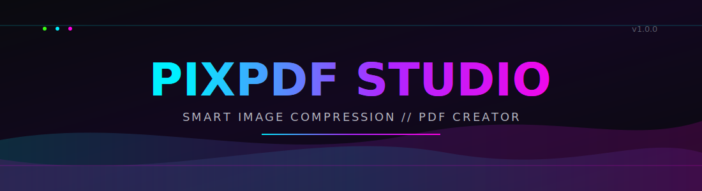
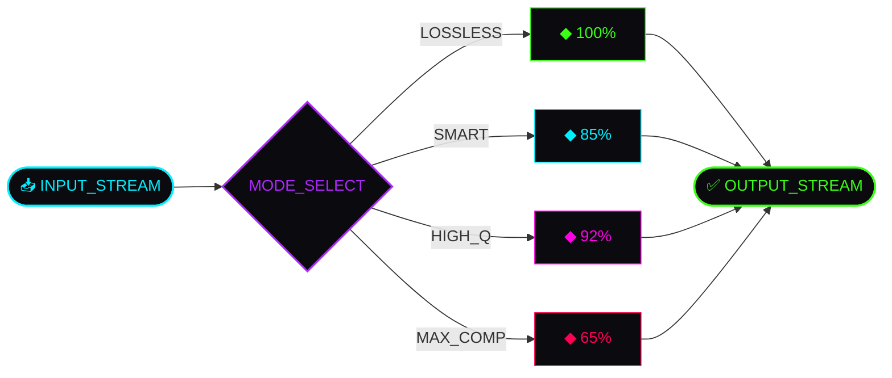
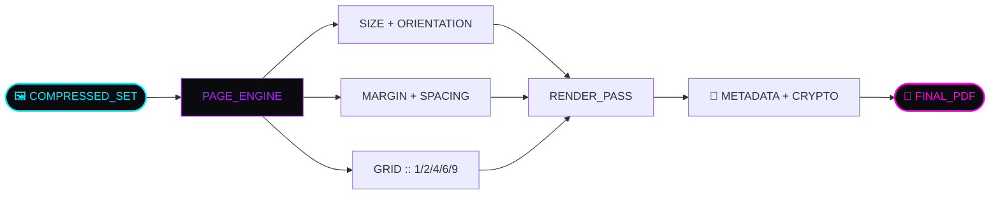

<div align="center">




<br/>


<br/>


<br/><br/>


</div>

<br/>

<p align="center">
<a href="#-modules"></a>
<a href="#-install"></a>
<a href="#-launch"></a>
<a href="#-core"></a>
<a href="#-team"></a>
</p>

<br/>

---

<br/>

<div align="center">

## ▸ SYSTEM OVERVIEW

</div>

<table>
<tr>
<td width="100%">

```yaml
name: PixPDF Studio
type: desktop_application
runtime: Python 3.12+ / PySide6 (Qt6)
purpose: >
  Batch-compress images with named quality presets,
  then render them into fully configurable, encrypted PDF documents —
  through a dark-native, neon-accented interface that never blocks.
threading: async / QThreadPool
status: production-ready
```

</td>
</tr>
</table>

<br/>

---

<br/>

<div align="center">

## ▸ MODULES

</div>

<table>
<tr>
<td width="25%" align="center">

### 🗜️
**COMPRESSION**
<br/>
<sub><code>4 modes</code> · <code>live quality slider</code></sub>

</td>
<td width="25%" align="center">

### 📐
**LAYOUT ENGINE**
<br/>
<sub><code>grid render</code> · <code>margin control</code></sub>

</td>
<td width="25%" align="center">

### 🔐
**CRYPTO LAYER**
<br/>
<sub><code>AES password</code> · <code>permissions</code></sub>

</td>
<td width="25%" align="center">

### ⚡
**ASYNC CORE**
<br/>
<sub><code>QThreadPool</code> · <code>zero freeze</code></sub>

</td>
</tr>
</table>

<br/>

### ▹ COMPRESSION.MODULE



<div align="center">

| MODE | TARGET | USE_CASE |
|:--|:-:|:--|
| 🟢 `LOSSLESS` | `100%` | archival — zero measurable loss |
| 🔵 `SMART_COMPRESSION` | `85%` | default — balanced size/quality |
| 🟣 `HIGH_QUALITY` | `92%` | print, presentations |
| 🔴 `MAXIMUM_COMPRESSION` | `65%` | bulk batch, email, web |

</div>

<br/>

### ▹ LAYOUT.MODULE



<div align="center">

| PARAMETER | VALUES |
|:--|:--|
| `page_size` | `A4` `A5` `Letter` `Legal` `Auto` `Original` |
| `orientation` | `Portrait` `Landscape` `Auto` |
| `margin / spacing` | `0–30mm` live slider |
| `grid` | `1` `2` `4` `6` `9` per page |
| `alignment` | `Center` `Stretch` `Fit` `Fill` |
| `pdf_quality` | `Maximum` `High` `Medium` `Small` |

</div>

<br/>

---

<br/>

<div align="center">

## ▸ FILE_OPS

</div>

<table>
<tr>
<td width="50%" valign="top">

```diff
+ MULTI-SELECT file dialog
+ RECURSIVE folder scan
+ NATIVE drag & drop
+ HASH-based duplicate flag
```

</td>
<td width="50%" valign="top">

```diff
+ DRAG-TO-REORDER list
+ ROTATE / FLIP / GRAYSCALE
+ INSTANT clear / remove
+ LIVE size + reduction % 
```

</td>
</tr>
</table>

<br/>

---

<br/>

<div align="center">

## ▸ INSTALL

</div>

```bash
# ── clone ──────────────────────────
git clone https://github.com/7Na7iD7/pixpdf-studio.git
cd pixpdf-studio

# ── virtualenv (recommended) ───────
python -m venv venv
source venv/bin/activate        # macOS / Linux
venv\Scripts\activate           # Windows

# ── install + run ──────────────────
pip install -r requirements.txt
python main.py
```

<details>
<summary><b>▸ BUILD_STANDALONE.exe</b></summary>

<br/>

```bash
pyinstaller --noconfirm --windowed --name "PixPDF Studio" --icon resources/icon.ico main.py
```

```bash
python -m nuitka --standalone --windows-disable-console --enable-plugin=pyside6 --output-dir=dist main.py
```

</details>

<br/>

---

<br/>

<div align="center">

## ▸ LAUNCH

</div>

<table>
<tr><td width="6%" align="center"><code>01</code></td><td>run <code>python main.py</code></td></tr>
<tr><td align="center"><code>02</code></td><td>drop images or use <b>Select Files</b> / <b>Select Folder</b></td></tr>
<tr><td align="center"><code>03</code></td><td>pick a compression mode — <code>Smart Compression</code> is default</td></tr>
<tr><td align="center"><code>04</code></td><td>tune layout, metadata, encryption</td></tr>
<tr><td align="center"><code>05</code></td><td>hit <b>Convert to PDF</b> — output opens on demand</td></tr>
</table>

<br/>

---

<br/>

<div align="center">

## ▸ CORE

</div>

```
PixPDFStudio/
├─ main.py · app.py ─────────────── entry point / QApplication bootstrap
│
├─ ui/
│  ├─ main_window.py ─────────────── orchestrates every panel
│  └─ theme.py ────────────────────── dark / light QSS design system
│
├─ widgets/
│  ├─ drop_zone.py ────────────────── drag & drop surface
│  ├─ image_list_widget.py ────────── reorderable list, live stats
│  ├─ compression_panel.py ────────── mode / quality / resolution
│  ├─ pdf_settings_panel.py ───────── layout / metadata / security
│  ├─ status_panel.py ─────────────── progress + CPU/RAM monitor
│  └─ gradient_label.py ───────────── custom-painted gradient title
│
├─ services/
│  ├─ compressor.py ───────────────── compression engine
│  ├─ pdf_builder.py ──────────────── grid layout + PDF render
│  ├─ image_loader.py ─────────────── scan / thumbnail / dedupe
│  ├─ metadata.py ─────────────────── pikepdf metadata + crypto
│  ├─ settings_service.py ─────────── persisted JSON preferences
│  └─ workers.py ──────────────────── QThreadPool async pipeline
│
├─ models/ ─────────────────────────── ImageItem, AppSettings dataclasses
├─ utils/ ──────────────────────────── logger, system monitor
└─ tests/ ──────────────────────────── unit tests for core services
```

<div align="center">


</div>

<br/>

---

<br/>

<div align="center">

## ▸ ROADMAP.log

</div>

```diff
+ [DONE]     multi-mode smart compression engine
+ [DONE]     full PDF layout builder with grid support
+ [DONE]     metadata editing + password encryption
+ [DONE]     dark / light neon-accented theme
! [PENDING]  interactive crop tool with live preview
! [PENDING]  live multi-page PDF preview before export
! [PENDING]  AVIF / HEIC input support
! [PENDING]  Persian/RTL UI language toggle
```

<br/>

---

<br/>

<div align="center">

## ▸ CONTRIBUTE

</div>

```bash
git checkout -b feature/your-feature-name
git commit -m "add: description of your change"
git push origin feature/your-feature-name
```

<div align="center">

| AREA | IDEAS |
|:--|:--|
| 🖼️ compression | AVIF/HEIC support, perceptual quality scoring |
| 📐 layout | custom templates, cover page generator |
| 🎨 ui | interactive crop tool, live PDF preview |
| 🌐 i18n | full RTL language pack |
| 🧪 tests | widget & worker-thread coverage |

</div>

<br/>

---

<br/>

<div align="center" id="-team">

## ▸ TEAM

<table>
<tr>
<td align="center">
<a href="https://github.com/7Na7iD7">
<br/>
<b>Na7iD</b><br/>
<sub>core / engine</sub>
</a>
</td>
<td align="center">
<a href="https://github.com/nikifarzami" style="text-decoration:none">
<br/>
<b>Niki</b><br/>
<sub style="text-decoration:none">ui / systems</sub>
</a>
</td>
</tr>
</table>

<br/>


<br/><br/>


</div>

<br/>


